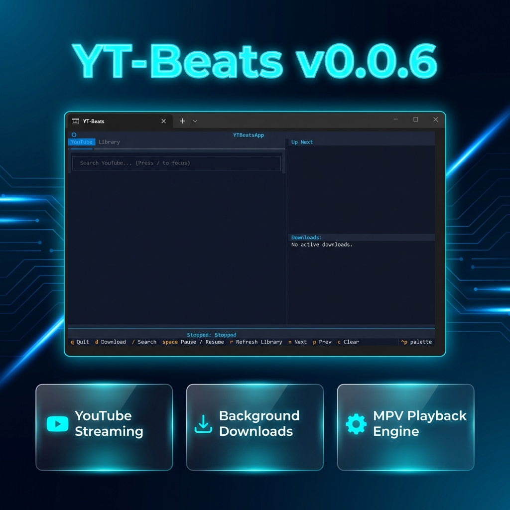

# YT-Beats

[](https://www.gnu.org/licenses/gpl-3.0)
[](https://www.python.org/downloads/)



**"The minimal, cross-platform terminal music player for YouTube and local audio."**

A keyboard-driven music experience designed for speed and focus. YT-Beats combines the power of `yt-dlp` and `mpv` with a modern TUI built on `Textual`.

## Features
- **Textual TUI**: Modern, keyboard-driven interface.
- **YouTube Integration**: Search and stream high-quality audio.
- **Bandwidth Optimized**: Streams and downloads pure audio data only, bypassing 90% of typical video bandwidth.
- **Smart Playback**: Prioritizes local files if already downloaded.
- **Lightweight**: Uses `mpv` for efficient playback.

## specific Requirements
- Python 3.9+
- [mpv](https://mpv.io/) connected to system PATH
- [ffmpeg](https://ffmpeg.org/) (Required for MP3 conversion)

## Installation

```bash
pip install -r requirements.txt
```

## Usage

### Starting the App
- **Windows**: Double-click `YT-Beats.bat` or run it from terminal.
- **Mac/Linux**: Run `./YT-Beats.sh` from terminal.
- **Manual**: `python -m src.app`

### Controls
- **Navigation**: Use **Arrow Keys** (Up/Down/Left/Right) to browse results and switch between tabs.
- **Search**: Press **/** to focus the search bar. Type and press **Enter**.
- **Play**: Press **Enter** on a result to start streaming.
- **Next/Prev**: Press **n** for Next track, **p** for Previous track.
- **Volume**: Press **]** to increase volume, **[** to decrease volume.
- **Pause/Resume**: Press **Space**.
- **Download**: Press **d** on a result to download high-quality audio to your local library.
- **Refresh Library**: Press **r** to scan your download folder.
- **Clear Queue**: Press **c**.
- **Quit**: Press **q**.

### Features
- **Modern Tabbed TUI**: Effortlessly switch between YouTube Search, Local Library, and Active Downloads.
- **Smart Duplicate Prevention**: Automatically checks your library using Video IDs to prevent re-downloading existing songs.
- **Bandwidth Optimized**: Streams and downloads pure audio data only, bypassing 90% of typical video bandwidth.
- **Process Decoupling**: Uses MPV as a background process; your music keeps playing even if the UI refreshes.
- **High-Contrast Design**: Optimized for readability with a sleek, cyan-accented slate theme.


**Note**: You must have `mpv` installed for audio playback.

## Documentation

- [Code Documentation](CODE_DOCUMENTATION.md) - Detailed technical overview.
- [Design Philosophy](DESIGN_PHILOSOPHY.md) - Why this project exists.
- [Contributing](CONTRIBUTING.md) - How to help the project.

## Running

```bash
python -m src.app
```
